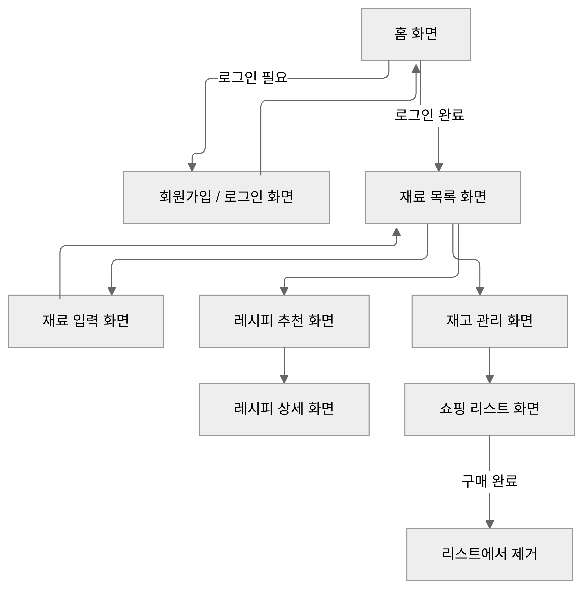
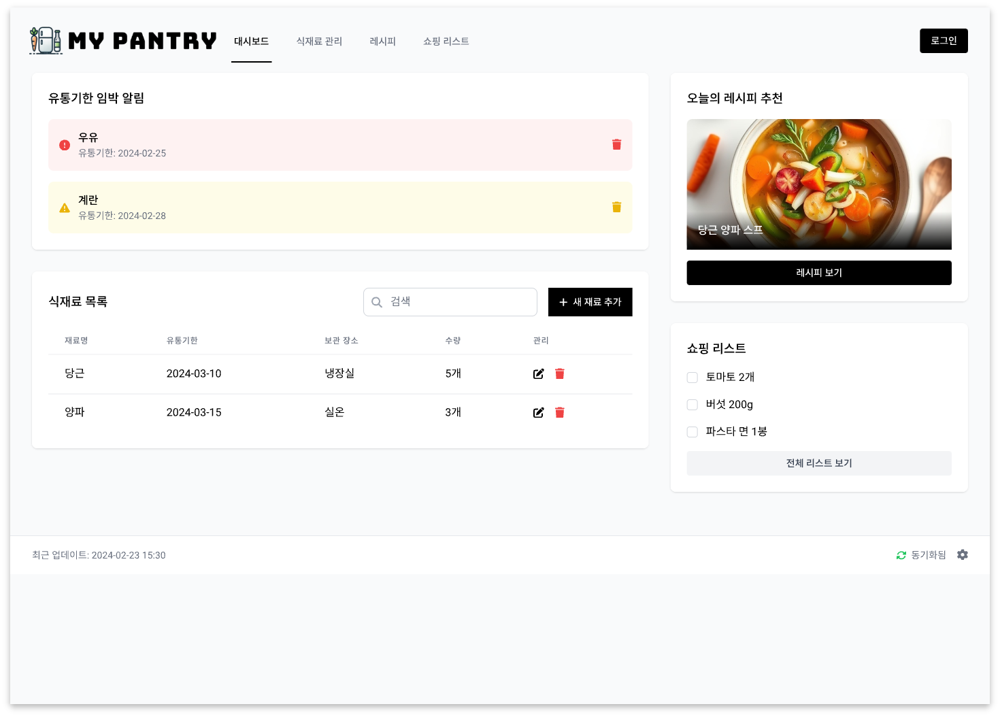
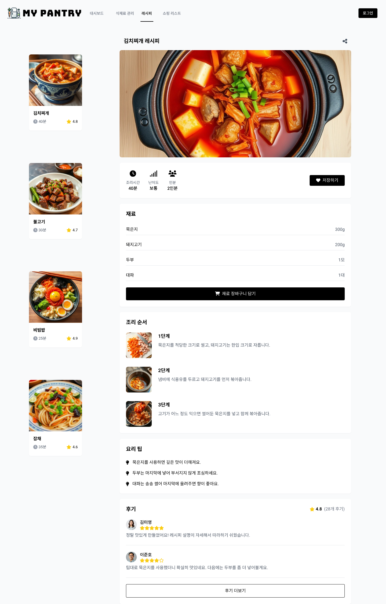

# 냉장고 및 식재료 관리 웹페이지 화면 정의서

## 1. 홈 화면

- **화면 이름**: 홈 화면
- **화면 설명**: 사용자가 웹페이지에 처음 접속할 때 보이는 화면입니다. 로그인 상태에 따라 제공하는 정보가 다르며, 로그인하지 않은 사용자에게는 회원가입 및 로그인 버튼을 제공합니다. 로그인한 사용자는 보유 재료의 현황과 임박한 유통기한 알림을 확인할 수 있습니다.
- **구성 요소**:
  - 회원가입 버튼 (로그인하지 않은 사용자)
  - 로그인 버튼 (로그인하지 않은 사용자)
  - 재료 현황 요약 (로그인한 사용자)
  - 유통기한 임박 알림 (로그인한 사용자)
- **주요 기능**:
  - 회원가입 및 로그인 유도
  - 유통기한이 임박한 재료 알림 제공

## 2. 회원가입 / 로그인 화면

- **화면 이름**: 회원가입 / 로그인 화면
- **화면 설명**: 사용자 계정을 생성하고 로그인할 수 있는 화면입니다.
- **구성 요소**:
  - 이메일 입력 창
  - 비밀번호 입력 창
  - 회원가입 버튼
  - 로그인 버튼
- **주요 기능**:
  - 사용자 계정 생성
  - 사용자 로그인 처리

## 3. 재료 입력 화면

- **화면 이름**: 재료 입력 화면
- **화면 설명**: 사용자가 보유하고 있는 식재료 정보를 입력하여 데이터베이스에 저장하는 화면입니다.
- **구성 요소**:
  - 재료명 입력 창
  - 유통기한 입력 창
  - 보관 장소 선택 (냉장/냉동/실온)
  - 보관 방법 입력 창
  - 저장 버튼
- **주요 기능**:
  - 식재료 정보 입력 및 데이터베이스에 저장

## 4. 재료 목록 화면

- **화면 이름**: 재료 목록 화면
- **화면 설명**: 사용자가 등록한 모든 재료를 목록 형태로 확인할 수 있는 화면입니다.
- **구성 요소**:
  - 재료 목록 테이블 (재료명, 유통기한, 보관 장소 등)
  - 재료 수정 버튼
  - 재료 삭제 버튼
  - 정렬 및 필터링 옵션
- **주요 기능**:
  - 재료 정보 수정 및 삭제
  - 유통기한에 따른 재료 정렬 및 필터링

## 5. 레시피 추천 화면

- **화면 이름**: 레시피 추천 화면
- **화면 설명**: 사용자가 보유한 재료를 바탕으로 AI가 추천하는 레시피 목록을 확인할 수 있는 화면입니다.
- **구성 요소**:
  - 레시피 카드 목록 (레시피 이미지, 제목 등)
  - 레시피 상세 보기 버튼
- **주요 기능**:
  - AI 레시피 추천 제공
  - 레시피 상세 정보 확인

## 6. 재고 관리 화면

- **화면 이름**: 재고 관리 화면
- **화면 설명**: 현재 보유 중인 재료의 재고 상태를 한눈에 볼 수 있는 화면입니다. 부족한 재료는 강조 표시됩니다.
- **구성 요소**:
  - 재고 현황 목록 (재료명, 재고 상태 등)
  - 재고 추가 버튼
  - 쇼핑 리스트에 추가 버튼
- **주요 기능**:
  - 재고 상태 확인 및 추가
  - 재구매가 필요한 재료를 쇼핑 리스트에 추가

## 7. 쇼핑 리스트 화면

- **화면 이름**: 쇼핑 리스트 화면
- **화면 설명**: 사용자가 재구매가 필요하다고 표시한 재료 목록을 관리하는 화면입니다.
- **구성 요소**:
  - 쇼핑 리스트 항목 (재료명, 수량 등)
  - 구매 완료 체크박스
- **주요 기능**:
  - 재료 구매 완료 시 체크하여 리스트에서 제거
  - 쇼핑 리스트 관리

## 참고 이미지

