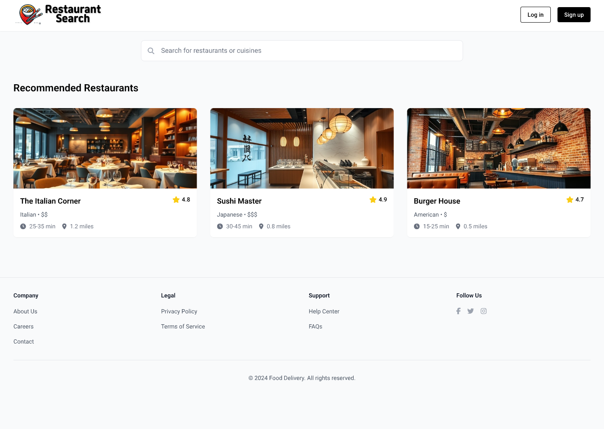
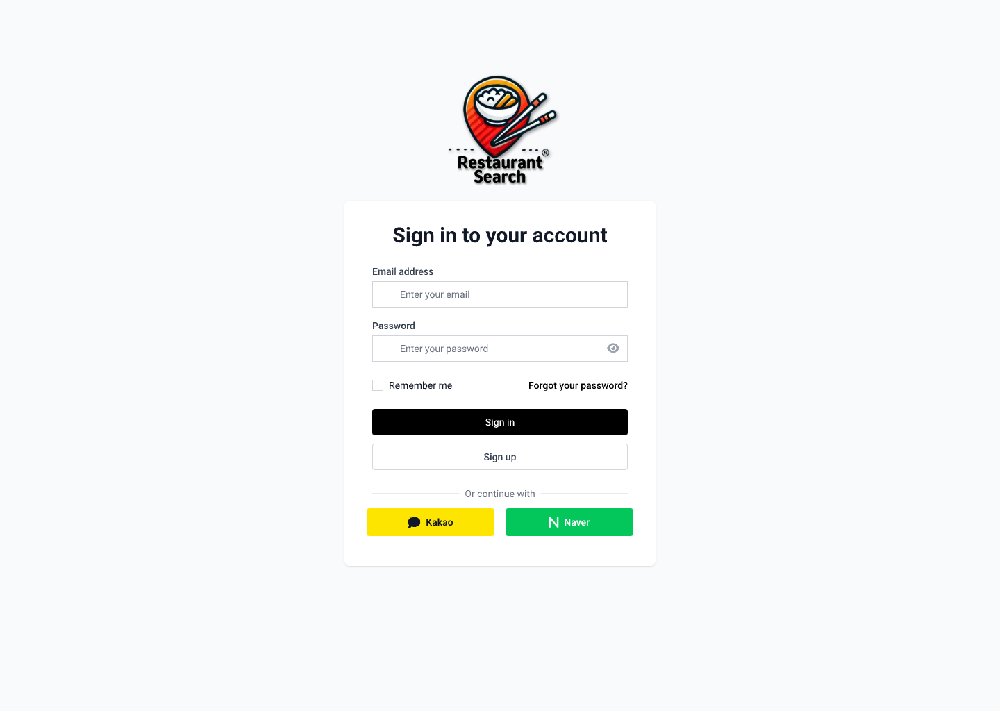
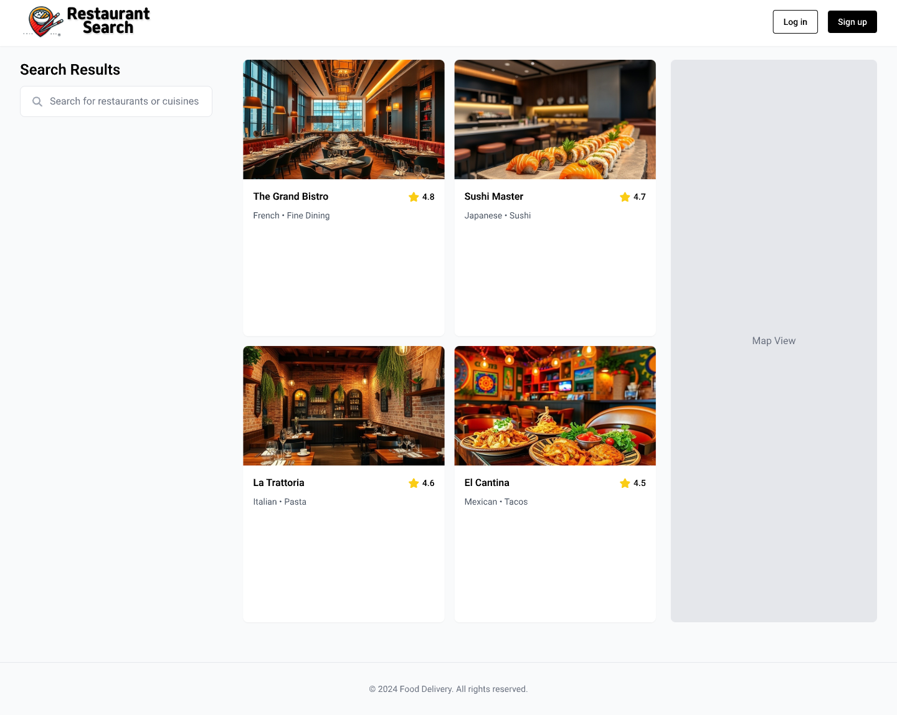
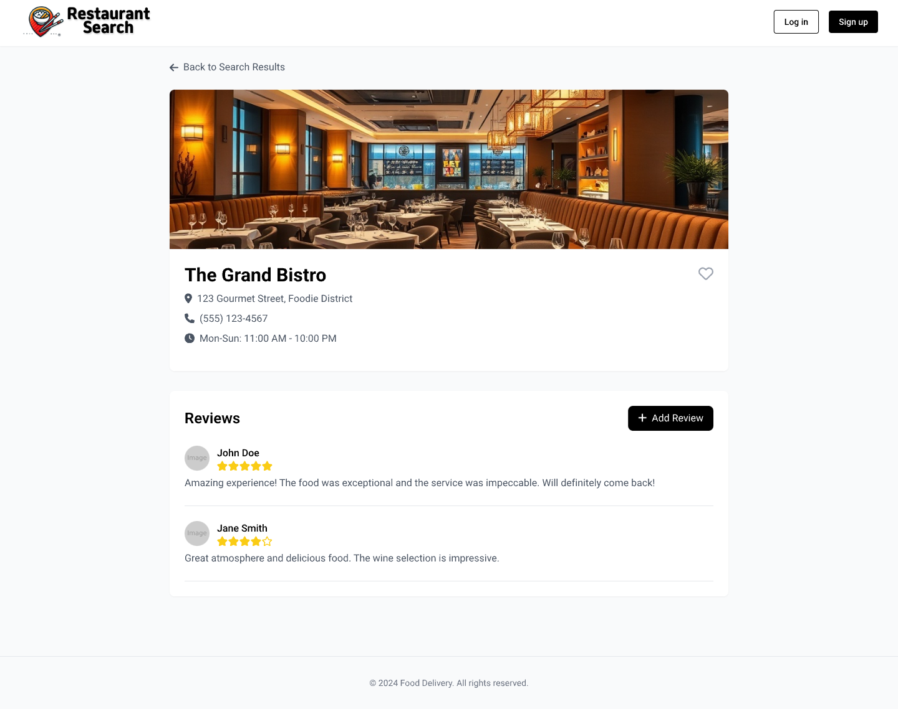
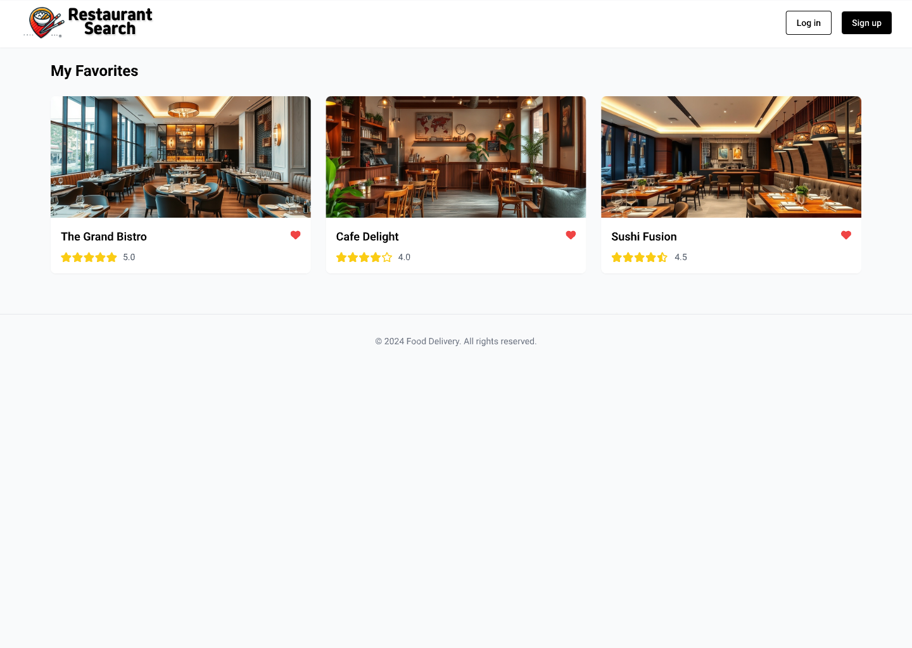

# 맛집검색 웹페이지 화면 정의서

## 1. 홈 화면

### 구성 요소

- **헤더**
  - 로고
  - 회원가입 및 로그인 버튼 (비로그인 상태)
  - 사용자 이름 및 로그아웃 버튼 (로그인 상태)
- **검색 영역**
  - 검색 입력 창
  - 검색 버튼
- **추천 맛집 섹션**
  - 인기 맛집 카드 리스트 (이미지, 이름, 평점 표시)

### 주요 기능

- 검색어 입력 및 검색 결과 페이지로 이동
- 로그인/회원가입 페이지로 이동
- 추천 맛집 리스트 클릭 시 상세 페이지로 이동

---

## 2. 회원가입 / 로그인 화면

### 구성 요소

- **헤더**
  - 로고
- **회원가입 / 로그인 폼**
  - 이메일 입력 필드
  - 비밀번호 입력 필드
  - 회원가입 버튼 / 로그인 버튼
- **소셜 로그인**
  - Kakao, Naver, Google 소셜 로그인 버튼

### 주요 기능

- 이메일/비밀번호로 계정 생성 및 로그인
- 소셜 로그인 처리
- 입력 오류 시 에러 메시지 표시

---

## 3. 검색 결과 화면

### 구성 요소

- **헤더**
  - 로고
  - 검색 입력 창 및 검색 버튼
  - 사용자 이름 및 로그아웃 버튼 (로그인 상태)
- **검색 결과 리스트**
  - 맛집 카드 리스트 (이미지, 이름, 평점, 간단한 설명 표시)
- **지도 영역**
  - Kakao/Naver 지도 연동
  - 맛집 위치 핀 표시

### 주요 기능

- 검색 결과 클릭 시 맛집 상세 페이지로 이동
- 지도와 리스트 동기화

---

## 4. 맛집 상세 화면

### 구성 요소

- **헤더**
  - 로고
  - 사용자 이름 및 로그아웃 버튼 (로그인 상태)
- **맛집 정보 섹션**
  - 이름, 이미지, 주소, 연락처, 영업 시간, 평점
- **리뷰 섹션**
  - 사용자 리뷰 리스트
  - 리뷰 작성 폼 (로그인 상태일 때만 표시)
- **즐겨찾기 버튼**
  - 로그인 상태에서 즐겨찾기 추가/삭제

### 주요 기능

- 리뷰 작성 및 저장
- 즐겨찾기 추가/삭제

---

## 5. 리뷰 작성 화면

### 구성 요소

- **헤더**
  - 로고
- **리뷰 작성 폼**
  - 별점 선택
  - 텍스트 입력 필드
  - 이미지 업로드 기능
  - 저장 버튼

### 주요 기능

- 리뷰 작성 및 저장
- 입력 오류 시 에러 메시지 표시

---

## 6. 즐겨찾기 화면

### 구성 요소

- **헤더**
  - 로고
  - 사용자 이름 및 로그아웃 버튼
- **즐겨찾기 리스트**
  - 즐겨찾기한 맛집 카드 리스트 (이미지, 이름, 평점 표시)

### 주요 기능

- 맛집 카드 클릭 시 상세 페이지로 이동
- 즐겨찾기 해제 기능

---

## 7. 에러 화면

### 구성 요소

- **에러 메시지**
  - "페이지를 찾을 수 없습니다." 또는 "오류가 발생했습니다." 텍스트
  - 홈 화면으로 돌아가기 버튼

### 주요 기능

- 홈 화면으로 이동

### 목업

