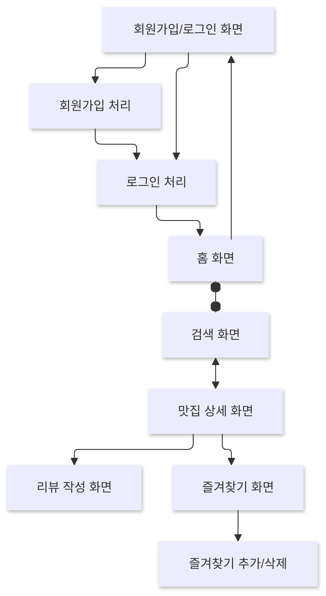

# 회의록

## 1. 기본 정보

- **회의 날짜**: 2024-12-11
- **회의 시간**: 17 : 30 ~ 18 : 25
- **회의 장소**: 강의실
- **참석자**: 채준병, 채준병, 박제성, 강경훈, 이희범, 심유정
- **기타**: 장원준(불참, 예비군훈련)   

---

## 2. 주요 내용    

- **논의 안건** : DB구축, 개발툴 및 기타 개발방향   
- ## **결정 사항**
  - API로 가져 올 수 있는 정보 한계있음. 또한 크롤링이 막혀있는경우가 많음.
  - 직접 데이터 구축하는 경우의 수도 고려해야 함.
  - 개발툴은 Node.js사용하기로 결정
  - 템플릿 대략적인 틀 결정(*사진 참고)
  - 소셜로그인은 수업중에 배운 구글로그인과 DB연동 직접로그인 구현을 우선으로 구현 후 여유있을 경우 추가 구현.
  - 현실적인 목표를 위해 검색 구역은 구로, 금천, 광명으로 한정해서 구현예정
  - 점포정보는 어디까지 담을것인가?
    - 구현 예정
      - 상호
      - 주소
      - 전화번호
      - 위치 (지도표시)
    - 추가 예정
      - 메뉴
      - 영업시간
      - ETC
  - 리뷰 및 평점은 별도 DB에 구축

- ## **다음 회의시 참고 사항**
  - 화면 기능 흐름 구체화
  - DB 구축 방향
  - git 구축

---
   
 
 
 
 

## 3. 기타

- **비고** : 참고 화면 흐름도   

- **작성자**: 채준병
